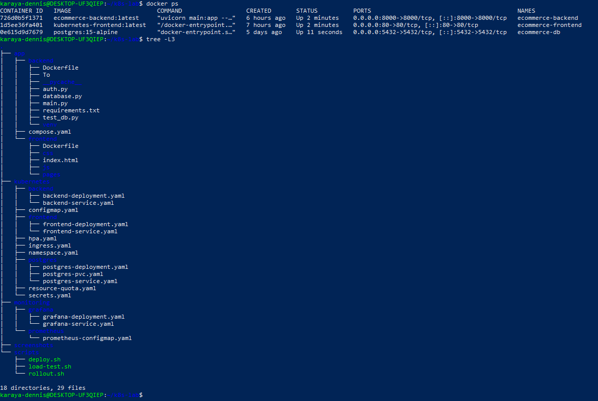
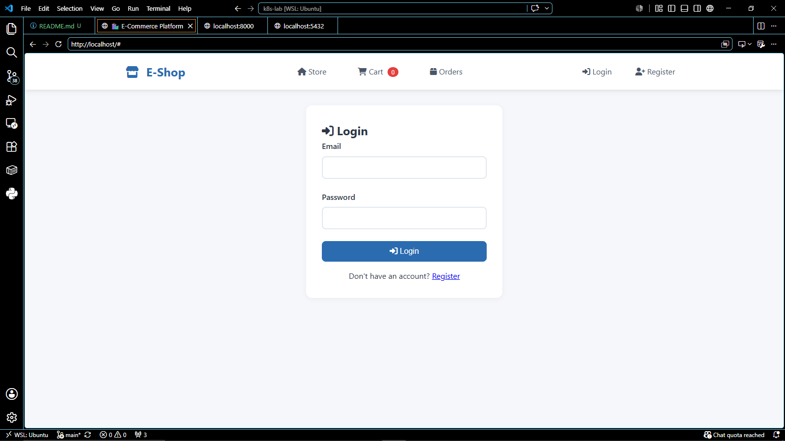
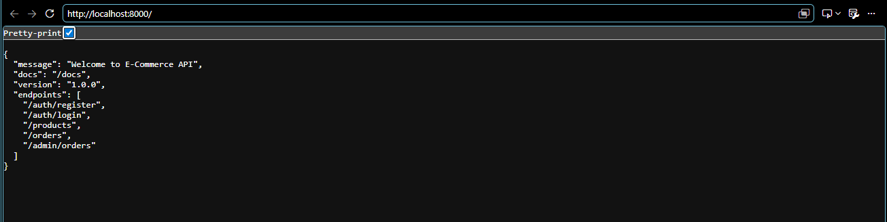
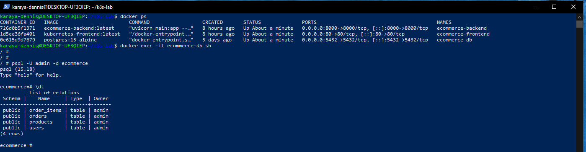
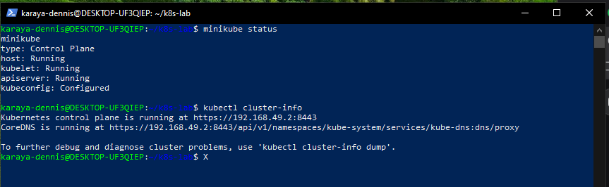
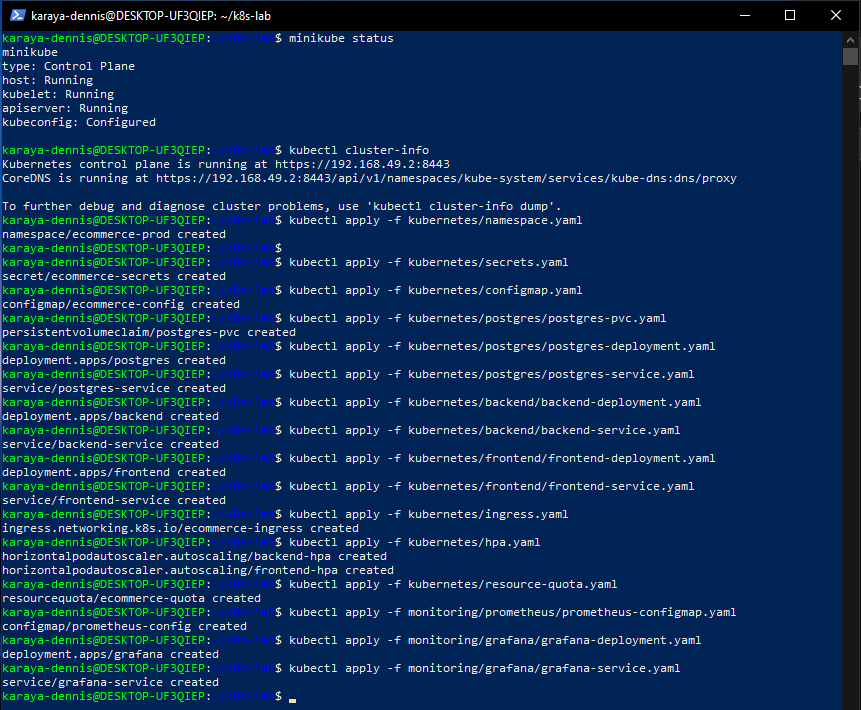
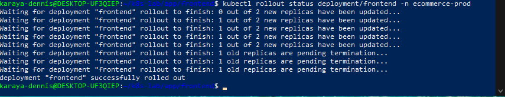
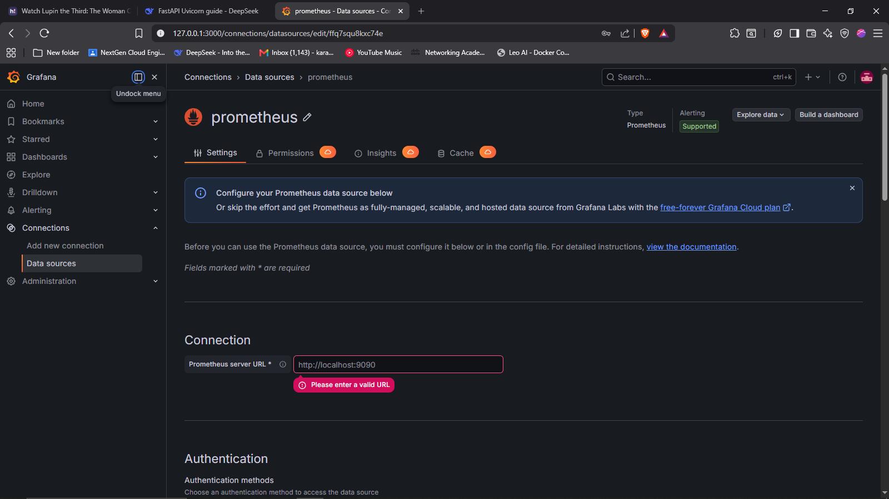
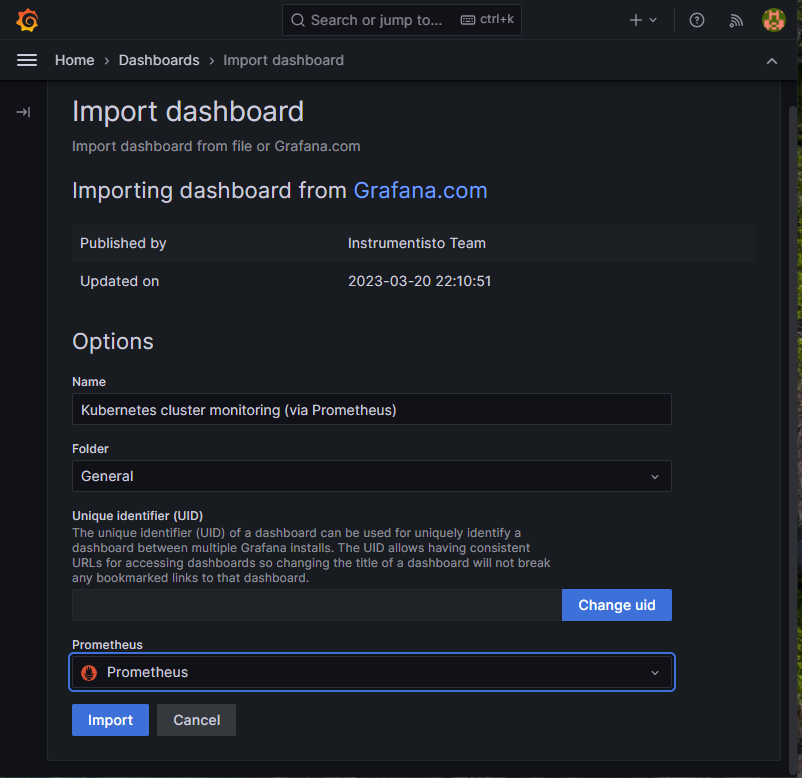

## ecommerce-platform structure




## app-structure 
```
┌─────────────────────────────────────────────────────────┐
│                    USER BROWSER                         │
│                   http://localhost                      │
└────────────────────┬────────────────────────────────────┘
                     │
                     ▼
┌─────────────────────────────────────────────────────────┐
│              FRONTEND (Nginx)                           │
│              Port 80 → Static Files                     │
│              /api/* → Proxy to Backend                  │
└────────────────────┬────────────────────────────────────┘
                     │
                     ▼
┌─────────────────────────────────────────────────────────┐
│              BACKEND (FastAPI)                          │
│              Port 8000                                  │
│              JWT Authentication                         │
│              CRUD Operations                            │
└────────────────────┬────────────────────────────────────┘
                     │
                     ▼
┌─────────────────────────────────────────────────────────┐
│              DATABASE (PostgreSQL)                      │
│              Port 5432                                  │
│              Tables: users, products, orders,           │
│              order_items                                │
└─────────────────────────────────────────────────────────┘
```

This project demonstrates a complete deployment of an E-Commerce platform with:

- **Frontend**: Static HTML/CSS/JS served by Nginx




- **Backend**: FastAPI REST API with JWT authentication



- **Database**: PostgreSQL with persistent storage



## Services Deployed

| Service | Type | Port |
|---------|------|------|
| Frontend | ClusterIP | 80 |
| Backend | ClusterIP | 8000 |
| PostgreSQL | ClusterIP | 5432 |
| Grafana | ClusterIP | 3000 |

## Kubernetes Resources
- Deployments (frontend, backend, postgres, grafana)
- Services (ClusterIP)
- PersistentVolumeClaim (postgres)
- ConfigMap & Secrets
- HorizontalPodAutoscaler (HPA)
- Ingress (ecommerce.local)
- ResourceQuota

installed minikube and started it,,,



loaded my docker images into minikube


applied my k8s manifests into my namespace (ecommerce-prod)



perfomed a rollout on the backend image with kubernetes-backend:v2



used grafana and prometheus for monitoring the cluster






